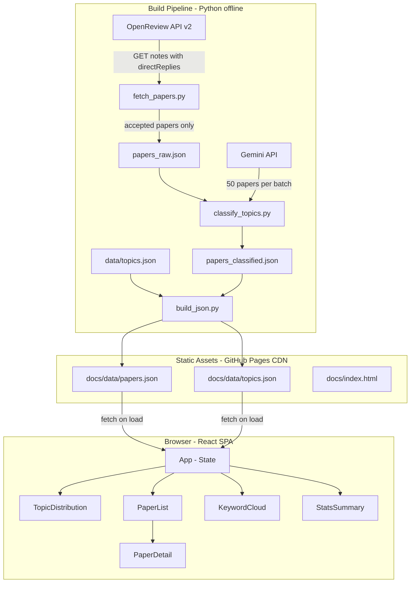
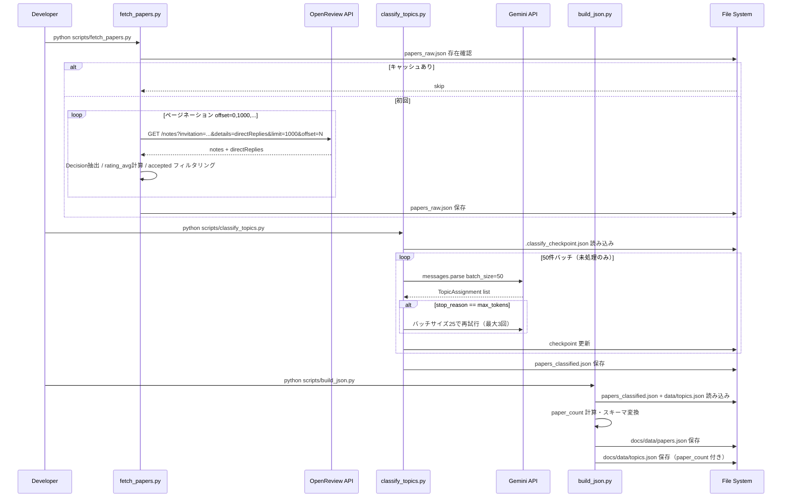
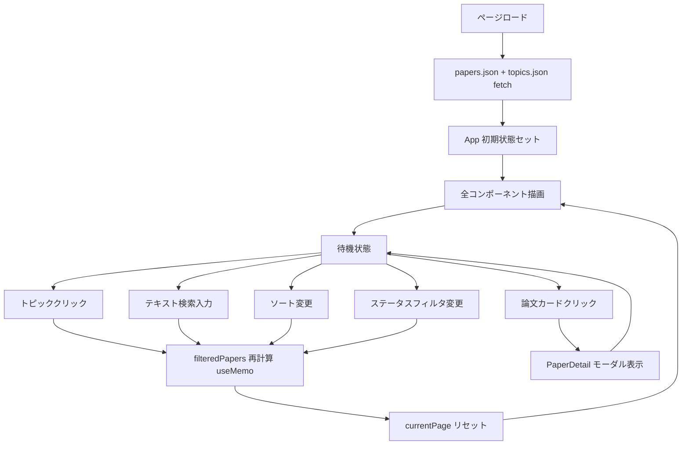
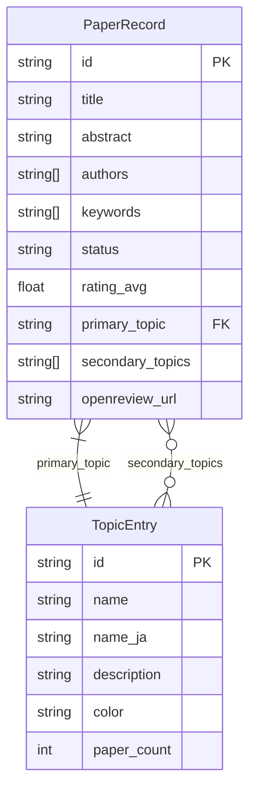

# 技術設計書 — ICLR 2026 Topic Explorer

## Overview

本システムは研究者・学生・一般閲覧者が ICLR 2026 採択論文（約 5,343 件）をトピック単位でインタラクティブに探索できる、無償・公開の Web サービスである。OpenReview API v2 からメタデータを取得し、Gemini API（`gemini-3.5-flash`）でトピック分類を行い、分類済みデータを静的 JSON として GitHub Pages 上に公開する。

アーキテクチャは「ビルドパイプライン（Python、オフライン実行）」と「静的フロントエンド（React 18 SPA、GitHub Pages）」の 2 層で構成される。ブラウザからのリアルタイム API 通信は発生せず、すべての分類処理はビルド時に完結する。これにより、サーバー運用コストゼロ・無制限スケール・高可用性（GitHub Pages SLA 99.9%）を実現する。

### Goals

- ICLR 2026 全採択論文をトピック別にブラウジングできる公開 Web サービスの構築（F-01〜F-08）
- ビルドパイプライン 60 分以内・初回ページロード 3 秒以内・フィルタ応答 100ms 以内の達成
- ICLR 2027 以降へ設定変更のみで対応できる保守性の確保

### Non-Goals

- 論文 PDF の取得・全文表示・全文検索
- ユーザー認証・個人化機能・リアルタイム更新
- サーバーサイド処理・バックエンド API サーバ
- Gemini Batch API による非同期分類（将来最適化候補、詳細は `research.md`）

---

## Boundary Commitments

### This Spec Owns

- `scripts/` 以下の 3 スクリプトすべての設計・インターフェース定義
- `data/papers_raw.json`・`data/papers_classified.json`・`docs/data/papers.json`・`docs/data/topics.json` のスキーマ定義と生成責任
- `docs/index.html` の React SPA 全体（コンポーネント構成・状態管理・UI 挙動）
- OpenReview API・Gemini API との統合契約

### Out of Boundary

- `data/topics.json`（トピック定義 JSON）の初期内容（手動作成・人間がメンテナンス）
- GitHub Pages の DNS・カスタムドメイン設定
- GitHub Actions ワークフロー YAML の詳細実装（CI/CD はオプション）

### Allowed Dependencies

- OpenReview API v2（`https://api2.openreview.net`）— 匿名アクセス可
- Gemini API（`gemini-3.5-flash`）— `GEMINI_API_KEY` 必須
- openreview-py v1.54.7 以上
- google-genai（Google Gen AI SDK）最新版以上（Python）
- React 18.3.1・ReactDOM 18.3.1・Recharts 2.x・Babel Standalone 7.x（CDN）

### Revalidation Triggers

- `papers.json` スキーマ変更（フィールド追加・削除）
- `topics.json` の id 体系変更（T-01 形式の変更）
- OpenReview API エンドポイント or レスポンス構造の変更
- Gemini API モデル変更（`gemini-3.5-flash` 廃止等）

---

## Architecture

### Architecture Pattern & Boundary Map



**Key Decisions**:
- 依存方向: `data files → App state → UI components`（上流への参照なし）
- ビルドパイプラインと SPA は JSON ファイルのみで結合（ランタイム依存なし）
- Gemini API 呼び出しはビルド時のみ（ブラウザから呼び出し禁止）

### Technology Stack

| レイヤ | 選択 / バージョン | 役割 |
|--------|-----------------|------|
| データ取得 | Python 3.11 + openreview-py 1.54.7 | OpenReview API v2 クライアント、自動ページネーション |
| AI 分類 | Python 3.11 + google-genai (Google Gen AI SDK) | Gemini API 同期呼び出し、Pydantic structured output |
| データ変換 | Python 3.11 + pandas | 集計・JSON 変換 |
| パッケージ管理 | uv + pyproject.toml | 依存管理・再現性 |
| フロントエンド | React 18.3.1 + JSX via Babel 7.x | SPA コンポーネント（CDN、ビルドツール不要） |
| チャート | Recharts 2.x | Treemap・BarChart（CDN） |
| ホスティング | GitHub Pages | 静的 CDN 配信、SLA 99.9% |
| CI/CD（オプション） | GitHub Actions | ビルドパイプライン自動化 |

---

## File Structure Plan

### Directory Structure

```
iclr-explorer/
├── pyproject.toml               # uv プロジェクト定義
├── uv.lock
├── README.md
├── scripts/
│   ├── fetch_papers.py          # PaperFetcher: OpenReview → papers_raw.json
│   ├── classify_topics.py       # TopicClassifier: papers_raw + Gemini API → papers_classified.json
│   └── build_json.py            # JsonBuilder: papers_classified + topics → docs/data/
├── data/
│   ├── topics.json              # トピック定義（手動管理、paper_count なし）
│   ├── papers_raw.json          # [生成物] accepted 論文の中間データ
│   ├── papers_classified.json   # [生成物] トピック分類済み中間データ
│   └── .classify_checkpoint.json  # [生成物] checkpoint（gitignore 推奨）
└── docs/
    ├── index.html               # React SPA エントリポイント（単一ファイル）
    └── data/
        ├── papers.json          # [生成物] 配信用論文データ
        └── topics.json          # [生成物] トピック定義 + paper_count
```

### Modified Files

- `data/topics.json` — 手動作成・更新のトピック定義ファイル（ソース）
- `docs/data/topics.json` — `build_json.py` が生成（paper_count 付き）

---

## System Flows

### ビルドパイプライン実行フロー



### フロントエンド状態遷移フロー



---

## Requirements Traceability

| 要件 | 概要 | コンポーネント | インターフェース | フロー |
|------|------|--------------|----------------|--------|
| 1.1〜1.7 | OpenReview からの論文取得 | PaperFetcher | `fetch_accepted_papers()` | Build Pipeline |
| 2.1〜2.7 | Gemini API によるトピック分類 | TopicClassifier | `classify_batch()` | Build Pipeline |
| 3.1〜3.6 | 静的 JSON 生成・GitHub Pages 配信 | JsonBuilder | `build_papers_json()` | Build Pipeline |
| 4.1〜4.3 | トピック分布可視化 | TopicDistribution | `onTopicSelect` callback | SPA Interaction |
| 5.1〜5.5 | 論文一覧・フィルタ・検索 | PaperList + App state | `useFilteredPapers()` | SPA Interaction |
| 6.1〜6.3 | 論文詳細表示 | PaperDetail | `onClose` callback | SPA Interaction |
| 7.1〜7.2 | キーワード雲 | KeywordCloud | `onKeywordSelect` callback | SPA Interaction |
| 8.1〜8.2 | 統計サマリ | StatsSummary | — | SPA Render |
| 9.1〜9.4 | パフォーマンス要件 | 全コンポーネント | — | — |
| 10.1〜10.5 | セキュリティ・法的要件 | PaperFetcher / JsonBuilder | — | Build Pipeline |
| 11.1〜11.4 | 保守性・拡張性要件 | 全スクリプト | `BuildConfig` | — |

---

## Components and Interfaces

### コンポーネント一覧

| コンポーネント | レイヤ | 役割 | 要件カバレッジ | 主要依存 |
|-------------|--------|------|-------------|---------|
| PaperFetcher | Build / Data | OpenReview 取得・accepted フィルタリング | 1.1〜1.7 | openreview-py (P0) |
| TopicClassifier | Build / AI | Gemini API バッチ分類・checkpoint | 2.1〜2.7 | google-genai (P0)、Pydantic (P0) |
| JsonBuilder | Build / Transform | JSON 正規化・スキーマ変換・paper_count 計算 | 3.1〜3.6、10.5 | pandas (P1) |
| App | Frontend / State | グローバル状態管理・データロード | 全 SPA 要件 | React 18 (P0)、papers.json・topics.json (P0) |
| TopicDistribution | Frontend / UI | Treemap + BarChart | 4.1〜4.3 | Recharts (P0)、App state (P0) |
| PaperList | Frontend / UI | フィルタ・ソート・検索・ページネーション | 5.1〜5.5 | App state (P0)、PaperDetail (P1) |
| PaperDetail | Frontend / UI | 論文詳細モーダル | 6.1〜6.3 | App state (P0) |
| KeywordCloud | Frontend / UI | キーワードタグクラウド | 7.1〜7.2 | App state (P0) |
| StatsSummary | Frontend / UI | 統計数値カード + スコア分布チャート | 8.1〜8.2 | App state (P0)、Recharts (P1) |

---

### Build Pipeline Layer

#### PaperFetcher

| フィールド | 詳細 |
|----------|------|
| Intent | OpenReview API v2 から ICLR 2026 採択論文のメタデータを取得し `papers_raw.json` に保存する |
| 要件 | 1.1, 1.2, 1.3, 1.4, 1.5, 1.6, 1.7 |

**Responsibilities & Constraints**
- `directReplies` から Decision ノードを抽出して accepted 論文のみをフィルタリングする（Oral/Poster 判定含む）
- `directReplies` から Review ノードを抽出して `rating_avg` を計算する（個別レビュアー情報は保持しない）
- `papers_raw.json` 存在時は実行をスキップする（冪等性）
- リクエスト間に 0.5 秒スリープを挿入する

**Dependencies**
- External: `openreview-py 1.54.7` — OpenReview API クライアント（P0）

**Contracts**: Batch [x]

##### Batch / Job Contract

```python
from typing import TypedDict

class FetchConfig(TypedDict):
    venue_id: str            # "ICLR.cc/2026/Conference"
    output_path: str         # "data/papers_raw.json"
    sleep_interval: float    # 0.5

class RawPaper(TypedDict):
    id: str
    title: str
    authors: list[str]
    abstract: str
    keywords: list[str]
    status: str              # "Oral" | "Poster"
    rating_avg: float        # 全レビューの数値レーティング平均
    openreview_url: str      # "https://openreview.net/forum?id={id}"

def fetch_accepted_papers(config: FetchConfig) -> list[RawPaper]: ...
```

- Trigger: CLI 実行（`python scripts/fetch_papers.py`）
- Input: OpenReview API（`ICLR.cc/2026/Conference/-/Submission`）
- Output: `data/papers_raw.json`（`list[RawPaper]`）
- Idempotency: `papers_raw.json` 存在時はスキップ

**Implementation Notes**
- Decision 文字列の期待パターン: "Accept: Oral Presentation"・"Accept: Poster"・"Accept"（実データ確認後に調整）
- rating は "6: marginally above acceptance threshold" 形式の文字列から数値部分を抽出してパース（`int(rating_str.split(":")[0])`）
- `get_all_notes()` が自動ページネーションを処理するため offset 管理は不要

---

#### TopicClassifier

| フィールド | 詳細 |
|----------|------|
| Intent | `papers_raw.json` の各論文に対し Gemini API でトピックを分類し `papers_classified.json` に保存する |
| 要件 | 2.1, 2.2, 2.3, 2.4, 2.5, 2.6, 2.7 |

**Responsibilities & Constraints**
- 50 件単位のバッチで同期 API 呼び出しを行う
- Pydantic モデルで structured output を強制する
- checkpoint ファイルで中断後の再開を保証する
- エラー率が 5% を超えた場合はビルドを中断する

**Dependencies**
- External: `google-genai (Google Gen AI SDK)` — Gemini API クライアント（P0）
- External: `pydantic` — structured output のスキーマ定義（P0）
- Inbound: `data/papers_raw.json` — PaperFetcher の出力（P0）
- Inbound: `data/topics.json` — トピック定義（P0）

**Contracts**: Batch [x]

##### Batch / Job Contract

```python
from pydantic import BaseModel
from typing import TypedDict

class TopicAssignment(BaseModel):
    paper_id: str
    primary_topic: str           # "T-01" 形式
    secondary_topics: list[str]  # 0〜2 件、"T-XX" 形式

class ClassificationBatch(BaseModel):
    results: list[TopicAssignment]

class ClassifyConfig(TypedDict):
    input_path: str              # "data/papers_raw.json"
    output_path: str             # "data/papers_classified.json"
    topics_path: str             # "data/topics.json"
    checkpoint_path: str         # "data/.classify_checkpoint.json"
    model: str                   # "gemini-3.5-flash"
    batch_size: int              # 50
    max_retries: int             # 3

def classify_batch(
    papers: list[dict],
    topic_definitions: list[dict],
    config: ClassifyConfig,
) -> ClassificationBatch: ...
```

- Trigger: CLI 実行（`python scripts/classify_topics.py`）
- Input: `data/papers_raw.json` + `data/topics.json`
- Output: `data/papers_classified.json`
- Idempotency: checkpoint により処理済み paper_id はスキップ

**Implementation Notes**
- Gemini API の structured output は `response_mime_type="application/json"` + `response_schema=ClassificationBatch.model_json_schema()` で JSON を強制（スキーマ違反はAPIレベルで検出される）
- JSON パース失敗時はバッチサイズを 25 に縮小して最大 3 回リトライ
- リトライ対象: `429`（クォータ超過）・`5xx` エラーのみ。指数バックオフ（1s → 2s → 4s）+ ランダムジッター
- エラー率 = `null_count / total_processed`。5% 超でシステム終了コード 1 で中断
- checkpoint は `{paper_id: TopicAssignment}` 形式の JSON

---

#### JsonBuilder

| フィールド | 詳細 |
|----------|------|
| Intent | 中間データを UI 最適化 JSON（papers.json・topics.json）に変換して `docs/data/` に出力する |
| 要件 | 3.1, 3.2, 3.3, 3.4, 3.5, 3.6, 10.1, 10.5 |

**Responsibilities & Constraints**
- `papers_classified.json` + `data/topics.json` から `docs/data/papers.json` と `docs/data/topics.json` を生成する
- `papers.json` の gzip 圧縮後サイズが 2MB を超えた場合、`abstract` を先頭 500 文字に切り詰める
- 個別レビュアー情報（rating 詳細・reviewer ID）を出力に含めない（10.1）

**Dependencies**
- Inbound: `data/papers_classified.json` — TopicClassifier の出力（P0）
- Inbound: `data/topics.json` — トピック定義（P0）
- External: `pandas` — 集計処理（P1）

**Contracts**: Batch [x]

##### Batch / Job Contract

```python
from typing import TypedDict

class PapersMeta(TypedDict):
    generated_at: str    # ISO 8601
    total_papers: int
    model_used: str      # "gemini-3.5-flash"

class PaperRecord(TypedDict):
    id: str
    title: str
    authors: list[str]
    abstract: str        # 最大 500 文字（サイズ超過時に切り詰め）
    keywords: list[str]
    status: str          # "Oral" | "Poster"
    rating_avg: float
    primary_topic: str   # "T-01"
    secondary_topics: list[str]
    openreview_url: str

class PapersJson(TypedDict):
    meta: PapersMeta
    papers: list[PaperRecord]

class TopicEntry(TypedDict):
    id: str
    name: str
    name_ja: str
    description: str
    color: str           # CSS hex color
    paper_count: int     # build_json.py が計算

class TopicsJson(TypedDict):
    topics: list[TopicEntry]

def build_papers_json(
    classified_path: str,
    topics_def_path: str,
    output_papers: str,
    output_topics: str,
    model_used: str,
) -> None: ...
```

---

### Frontend Layer (React SPA)

> フロントエンドは JavaScript（JSX）。型定義は JSDoc + Python TypedDict 記法で記述。

#### App（状態管理）

| フィールド | 詳細 |
|----------|------|
| Intent | グローバル状態を保持し、JSON ロードと全コンポーネントへのデータ配布を行う |
| 要件 | 5.1〜5.5（フィルタ状態）、9.1（ロード時間） |

**State Model**

```js
// App グローバル状態
{
  papers: PaperRecord[],        // papers.json 全件
  topics: TopicEntry[],         // topics.json 全件
  loading: boolean,
  error: string | null,
  selectedTopic: string | null, // "T-01" | null
  statusFilter: string | null,  // "Oral" | "Poster" | null
  searchQuery: string,
  sortBy: "rating" | "title",   // デフォルト: "rating"
  currentPage: number,          // 1-indexed
  pageSize: number,             // 100
  selectedPaper: PaperRecord | null,
}
```

**Derived State（`useMemo`）**

```js
filteredPapers = papers
  .filter(p => !selectedTopic || p.primary_topic === selectedTopic
              || p.secondary_topics.includes(selectedTopic))
  .filter(p => !statusFilter || p.status === statusFilter)
  .filter(p => !searchQuery
              || p.title.toLowerCase().includes(searchQuery.toLowerCase())
              || p.abstract.toLowerCase().includes(searchQuery.toLowerCase()))
  .sort(/* rating desc or title asc */)
```

**Contracts**: State [x]

**Implementation Notes**
- `Promise.all([fetch('data/papers.json'), fetch('data/topics.json')])` で並行ロード
- `filteredPapers` の計算は `useMemo([papers, selectedTopic, statusFilter, searchQuery, sortBy])` でメモ化（100ms 以内要件 5.5）
- フィルタ変更時に `currentPage` を 1 にリセット

---

#### TopicDistribution

| フィールド | 詳細 |
|----------|------|
| Intent | トピック別論文数を Treemap と BarChart で可視化し、クリックでフィルタを適用する |
| 要件 | 4.1, 4.2, 4.3 |

**Contracts**: State [x]

- `onTopicSelect(topicId: string | null): void` — App の `selectedTopic` を更新
- Recharts `Treemap`（`data={topics}`、`dataKey="paper_count"`）でトピック分布を表示
- Recharts `BarChart`（水平バー、降順）でトピックランキングを表示
- バークリック時に `onTopicSelect(topicId)` を呼び出す（4.3）

---

#### PaperList

| フィールド | 詳細 |
|----------|------|
| Intent | `filteredPapers` をページネーション付きで一覧表示し、論文カードクリックで PaperDetail を開く |
| 要件 | 5.1〜5.5, 6.1 |

**Contracts**: State [x]

- `filteredPapers`（App から props）を `pageSize`（100）で切り出してレンダリング
- ページネーション UI（前/次ページボタン + ページ番号）を提供
- 各論文カードに タイトル・著者（先頭 3 名 + et al.）・採択ステータス・rating_avg・primary_topic を表示
- カードクリックで `onPaperSelect(paper: PaperRecord): void` を呼び出す

**Implementation Notes**
- `React.memo` でカードコンポーネントをメモ化し、フィルタ変更時の不要な再レンダリングを防止

---

#### PaperDetail

| フィールド | 詳細 |
|----------|------|
| Intent | 選択論文の詳細情報をモーダルで表示し、OpenReview へのリンクを提供する |
| 要件 | 6.1, 6.2, 6.3 |

**Contracts**: State [x]

- `paper: PaperRecord | null`（null 時は非表示）
- `onClose(): void`
- 表示: タイトル・著者全員・アブストラクト全文・rating_avg・status・primary_topic・secondary_topics
- OpenReview リンク: `<a href={paper.openreview_url} target="_blank" rel="noopener noreferrer">`（6.3）

---

#### KeywordCloud

| フィールド | 詳細 |
|----------|------|
| Intent | `papers` の keywords フィールドから頻出キーワードを集計してタグクラウドを表示する |
| 要件 | 7.1, 7.2 |

**Contracts**: State [x]

- 上位 100 キーワードを出現頻度に比例したフォントサイズ（12px〜36px）で表示
- キーワードクリック時に `onKeywordSelect(keyword: string): void` → App の `searchQuery` を更新（7.2）

---

#### StatsSummary

| フィールド | 詳細 |
|----------|------|
| Intent | 採択論文全体の統計情報（採択率・スコア分布・Oral/Poster 比率）を表示する |
| 要件 | 8.1, 8.2 |

**Contracts**: State [x]

- 数値カード: 総論文数・平均 rating・Oral 件数・Poster 件数
- Recharts `HistogramChart`（または `BarChart` でビン化したスコア分布）を表示

---

## Data Models

### Logical Data Model



### Data Contracts & Integration

**papers.json（UI 配信用）**

```json
{
  "meta": {
    "generated_at": "2026-05-30T00:00:00Z",
    "total_papers": 5343,
    "model_used": "gemini-3.5-flash"
  },
  "papers": [
    {
      "id": "openreview_id",
      "title": "...",
      "authors": ["Author 1", "Author 2"],
      "abstract": "...",
      "keywords": ["keyword1"],
      "status": "Poster",
      "rating_avg": 6.25,
      "primary_topic": "T-01",
      "secondary_topics": ["T-08"],
      "openreview_url": "https://openreview.net/forum?id=..."
    }
  ]
}
```

**topics.json（UI 配信用、paper_count 付き）**

```json
{
  "topics": [
    {
      "id": "T-01",
      "name": "Large Language Models",
      "name_ja": "大規模言語モデル",
      "description": "LLM, instruction tuning, RLHF, alignment ...",
      "color": "#4FB6C6",
      "paper_count": 842
    }
  ]
}
```

---

## Error Handling

### Error Strategy

ビルドパイプラインは fail-fast、フロントエンドは graceful degradation を原則とする。

### Error Categories and Responses

| エラー種別 | 発生箇所 | 対応 |
|----------|---------|------|
| OpenReview API HTTP エラー / タイムアウト | PaperFetcher | エラーログ出力して中断（要件 1.7） |
| Gemini API 429 / 5xx | TopicClassifier | 指数バックオフ + 最大 3 回リトライ（要件 2.4） |
| Gemini API max_tokens 切り詰め | TopicClassifier | バッチサイズ 25 に縮小して再試行 |
| 分類エラー率 5% 超 | TopicClassifier | 終了コード 1 で中断・アラート出力（要件 2.6） |
| papers.json fetch 失敗 | App (SPA) | エラーメッセージ表示（ページ全体）|
| 個別コンポーネントレンダリングエラー | SPA | React Error Boundary で隔離（他機能は継続） |

### Monitoring

- ビルドパイプライン: 標準出力に処理件数・エラー率・経過時間を定期ログ
- SPA: `window.onerror` でキャッチしてコンソール出力（外部監視ツール不使用）

---

## Testing Strategy

### Unit Tests（ビルドパイプライン）

- `test_fetch_papers.py`: Decision ノードパース・rating_avg 計算・Oral/Poster 判定の正確性（モック API レスポンス使用）
- `test_classify_topics.py`: バッチ分類・checkpoint 読み書き・エラー率計算のロジック（Gemini API はモック）
- `test_build_json.py`: JSON 変換・paper_count 計算・2MB 超過時の abstract 切り詰め

### Integration Tests

- `test_fetch_integration.py`: 実 OpenReview API に対して少量（limit=10）で接続確認
- `test_classify_integration.py`: 実 Gemini API に対して 3 件バッチで structured output 確認

### E2E / Browser Tests

- トップページロードで Treemap・BarChart・StatsSummary が表示されること（AC-02）
- トピッククリックで PaperList が絞り込まれること（AC-03）
- キーワード検索でタイトル・アブストラクトに含む論文が表示されること（AC-04）
- 論文カード → OpenReview リンク遷移（AC-05）
- モバイル表示でレイアウト崩れなし（AC-06、DevTools エミュレーション）

### Performance Tests

- `papers.json` gzip サイズが 2MB 以内であること（AC-07 + NFR-P-3）
- フィルタ操作の所要時間が 100ms 以内であること（Chrome DevTools Performance）

---

## Security Considerations

- **API キー**: `GEMINI_API_KEY` は GitHub Actions Secrets のみに保管（要件 10.1）。`scripts/` コードは環境変数 `os.environ["GEMINI_API_KEY"]` でのみ受け取り、ファイルに書き出さない。
- **XSS 防止**: フロントエンドは React JSX を使用し `innerHTML` の直接操作を禁止（要件 10.5）。タイトル・アブストラクトはすべて JSX 式（`{variable}`）でレンダリング。
- **個人情報**: 個別レビュアー rating・reviewer ID は `papers_raw.json` に格納せず、取得時にフィルタリング（要件 10.1、10.5）。
- **外部リンク**: OpenReview URL に `rel="noopener noreferrer"` を付与（要件 6.3）。

## Performance & Scalability

- **papers.json サイズ**: gzip 2MB 制限。超過時は abstract を 500 文字に切り詰め（JsonBuilder）。
- **SPA フィルタ**: `filteredPapers` を `useMemo` でメモ化し 100ms 以内を保証。
- **チャートレンダリング**: Recharts Treemap / BarChart は 30 トピック（SVG 30 ノード）のため SVG ボトルネックは問題なし。
- **論文一覧**: ページネーション（100 件/ページ）で DOM ノード数を制限。仮想スクロール不採用（`research.md` 参照）。
- **CDN キャッシュ**: GitHub Pages は CDN でキャッシュを提供。`papers.json` は Content-Hash を付与しないため更新時はキャッシュバスト不要（静的サイトの全ファイル置き換え）。
